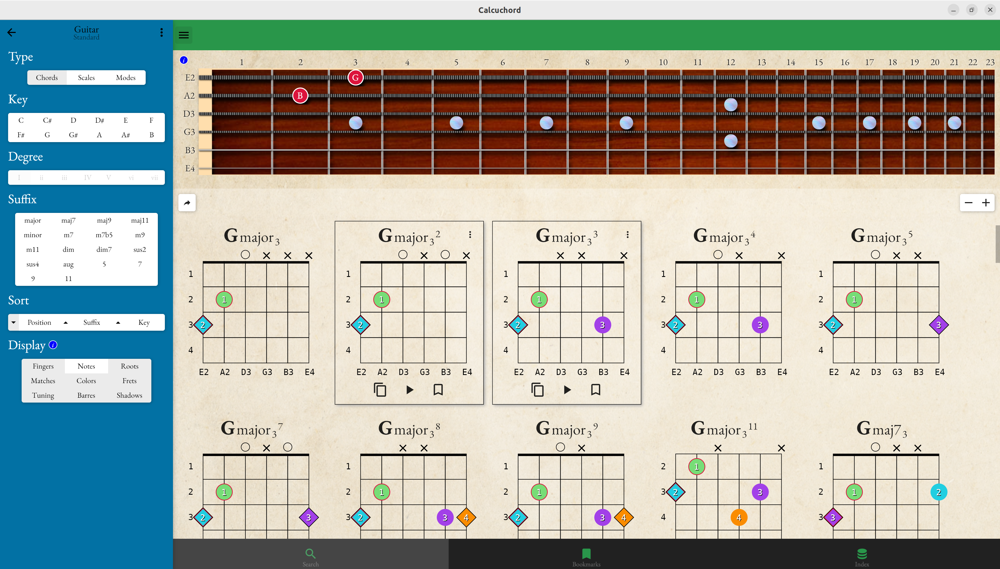

# Calcuchord

## Features

- 11 built-in tuning templates (guitar, ukulele, piano, bass, violin and more!)
- create your own instruments and tunings
- generates 1,000s of chords, scales and mode patterns
- bookmark your favorites
- sound preview using midi playback
- chord fingering discovery
- export to midi, pdf and html
- translate any pattern (chord, scale or mode) to any other tuning or instrument

## Releases

- [Web](https://tkefauver.github.io/Calcuchord/)
- [Mac App Store](https://apps.apple.com/us/app/calcuchord/id6742661582)
- [iOS App Store](https://apps.apple.com/us/app/calcuchord/id6742661582)
- [Windows Store](https://www.microsoft.com/store/apps/9MTMVS3TP34P)
- [Google Play Store](https://play.google.com/apps/testing/com.thomaskefauver.Calcuchord) - Early access & need testers!

